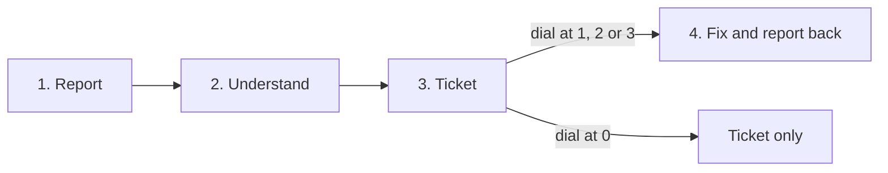

# Snapwing (working title)

**Decide how far the agent goes.** Stay in control from flag to fix.

Snapwing turns a bug report in a Slack thread into a ticket that names the code involved, and, if you allow it, into a reviewed fix.

> [!IMPORTANT]
> **In active development. Not installable yet.** There is no package, no install guide and no stable version. The code changes many times a day. Star or watch the repository to follow along.

## What it does

Someone asks "is checkout broken for anyone?" in Slack and drops a screenshot. A teammate reacts with 🐛. Snapwing reads the whole thread, screenshots included, checks for duplicates, and files a Jira ticket that names the code it thinks is involved. If you let it, a coding agent writes the fix, a separate review agent checks it, a pull request opens, and the status comes back to the same thread.

"If you let it" is the autonomy dial: admins set how far Snapwing goes on its own, per channel, component and priority.

**Is this for you?** You already run a coding agent, and you keep branch protection with required reviews on.

## How it works

1. **Report.** Someone posts about a bug in Slack, often with a screenshot, and a teammate reacts with 🐛.
2. **Understand.** Snapwing reads the thread and its images, works out the product area and its code from a workspace map, checks for duplicates, and asks one question back only when it has to.
3. **Ticket.** It files a Jira ticket that names the likely code, with a structured request a coding agent can act on.
4. **Fix and report back.** A coding agent writes the fix in a throwaway container, a separate review agent checks it, a pull request opens, and the status message in the thread is kept up to date.

## The autonomy dial

| Level | Name | The fix starts | Who merges |
|---|---|---|---|
| 0 | Ticket only | Never | Nobody: there is no fix |
| 1 | Fix on tap | When an engineer taps **Fix it** | A person |
| 2 | Start automatically | Once the ticket is filed, without a tap | A person (code owners are asked to review) |
| 3 | Autopilot | Once the ticket is filed, without a tap | The agent, only if the review agent, CI and the merge checks all pass |

Branch protection decides which merges need a person. The dial decides which work starts and how far it goes.

- The level is set per channel, component and priority. When several rules match, the most restrictive one wins, so a top-priority bug on an autopilot channel still gets a person.
- Turn a component down to ticket only without turning the agent off.
- At levels 2 and 3, every card and status message has a **Stop** button.
- The merge checks are mechanical: files touched, diff size, protected paths, and no changes to CI or test configuration.
- If any gate fails at level 3, the incident drops to level 2 and the thread says why. Nothing closes or disappears silently.
- Level 3 merges as Snapwing's GitHub App. On a protected branch, an admin must first add the App to the branch protection bypass list, and GitHub applies that exemption to the whole branch. Snapwing uses it only for work at level 3, and only after every gate passes.
- After an autopilot merge, a one-tap **Revert** stays available for 72 hours by default.
- Who changed a level, and when, is recorded.

## What works today

| | Status |
|---|---|
| Slack 🐛 to Jira ticket to the fixer's pull request, with the status message updated, at levels 1 and 2 | **Passes automated live tests** against real Slack, Jira and GitHub sandboxes |
| An engineer's 👀 claims the bug: the ticket is assigned to them and no fixer starts | **Passes automated live tests** |
| A pile of 🔥 reactions escalates: top priority, the owner mentioned, monitoring on | **Passes automated live tests** |
| "Where are we with the cart thing?" in a direct message gets a plain-language answer | **Passes automated live tests** |
| A screenshot of a staging site is checked with the reporter before anything is filed | **Passes automated live tests** |
| After a staging deploy, the reporter is asked to check, and their 👍 marks the fix verified | **Passes automated live tests**, with scripted stand-ins for the coding and review agents |
| Level 0 (ticket only) and level 3 (autopilot, with a one-tap Revert) | Built; tested against mocked services. The level 3 merge has run live only with scripted stand-ins for the coding and review agents |
| The coding agent runs in a throwaway container with no model API keys and short-lived tokens for one run; it can't change CI or branch protection | Built and covered by tests |
| Pluggable coding agents (Claude Code, Codex, Gemini CLI, or any command) and model providers (Anthropic, OpenAI, Google) | Built and covered by tests |
| Microsoft Teams | In progress, tested against mocks only |
| A command-line tool, a Raycast extension and a guided `snapwing onboard` setup | In progress |

How the live tests work, and what they don't cover yet

- The live tests post as real test users in a real Slack workspace, file real Jira issues, and open real pull requests on a test repository, using live models.
- Where Slack has no API for an action (a person tapping a button, or reactions from people the test workspace doesn't have), the tests send the same payloads Slack would.
- In those runs, the review agent is a scripted stand-in, and the coding agent is Claude Code or a scripted stand-in.
- So far, every live run has been driven by test scripts and agents. Hands-on use by a person comes next.

## What's coming

These are planned, not built:

- **Bug Memory:** when a new report matches a bug fixed before, you see the earlier ticket, its fix and any revert, and can reopen it in one tap.
- **Dry run:** see the fix before anything is pushed. By default it runs in a sandbox with the full test suite and the review agent, and you see the patch, the results and the verdict, then Apply, Revise or Discard. A quicker preview without tests is an option: Apply opens a pull request, never a push to `main`, and CI tests it there. A lead can also put a whole workspace in dry run until an end time they set, such as a few hours while a fix is prepared or deployed. Snapwing then files and pushes nothing, and reports what it would have done.
- **Risk index:** an uncalibrated 0 to 100 score with the factors behind it, on engineer-facing fix cards, and usable as a merge gate once an admin sets a threshold.
- **The dial, everywhere:** a visual dial in Slack and Teams, a per-incident override, temporary boosts that expire, and setup that asks a starting level for each component (skipping it leaves everything at ticket only).
- **Truthful status:** a merged fix is shown as merged, not fixed, until a deploy confirms it is live.
- **GitHub Issues as a tracker:** everything that works with Jira, also working with GitHub Issues and Projects.
- **More context:** specs and designs from Confluence, Figma, local folders and read-only MCP sources.
- **Working alongside other coding agents:** step aside when Copilot, Claude, Codex or another agent already has the work, or hand it to them.
- **Discord requests:** community members can ask for a fix; the team starts it from Slack.
- **Local-first mode:** read and fix in the checkouts already on your machine.
- **Scale and cost:** in-flight duplicate detection, fixer queues, the model cost of each incident, and a kill switch.
- **Richer evidence:** narrated screen recordings, log files and HAR files.
- **Snapwing supporting itself:** triaging the issues on this repository, with fixes arriving as dry runs.

## How it's being built

Snapwing is built by AI agents working from written specs, with one human owner.

- Every task is a GitHub issue with the spec sections it implements, the files it may touch, and acceptance criteria.
- Worker agents write the code and the tests. An orchestrator agent reviews each pull request and merges it only when the full test suite passes on both SQLite and Postgres.
- The owner writes the specs and the rules the agents work under, and does what only a person can: accounts, credentials and decisions.
- This README is written by Claude (an AI model by Anthropic), the build's orchestrator agent, not by a person. The owner reviews every change to it before it merges.

## Follow along

- **Star** the repository to find it later. **Watch** it if you want every change; build days are busy.
- Follow the author, [Yitz Jordan, on LinkedIn](https://www.linkedin.com/in/yitzjordan).
- Questions and suggestions are welcome as [issues](../../issues).

## License

[MIT](LICENSE).
